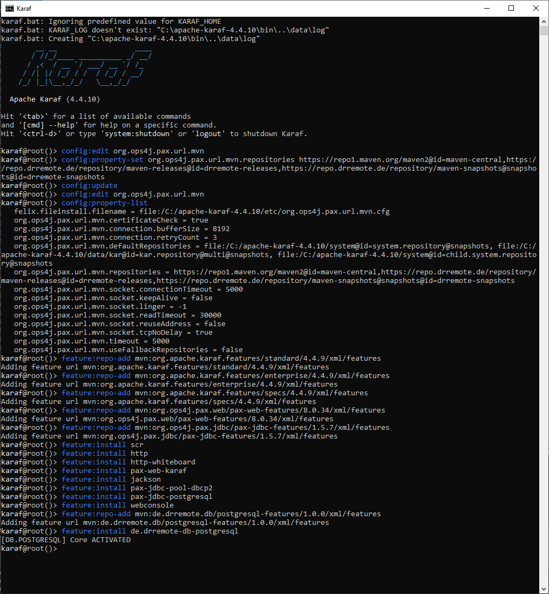

# DrRemote Karaf Setup

This repository documents the **basic Apache Karaf setup** required to run DrRemote modules on a fresh system.

Its purpose is to explain the full path from:

* downloading Karaf
* configuring Maven repositories
* installing the required base features
* installing DrRemote feature repositories
* installing DrRemote modules

---

## Command Screenshot

The following screenshot shows the full command sequence executed in the Karaf shell:



---

## Goal

After following this guide, a fresh Karaf installation should be able to:

* resolve artifacts from **Maven Central**
* resolve artifacts from the **DrRemote repositories**
* install the required Karaf base features
* install DrRemote feature repositories
* install DrRemote modules cleanly

---

## Versions Used in This Guide

This guide uses the following versions:

* **Apache Karaf**: `4.4.10`
* **Pax Web Features**: `8.0.34`
* **Pax JDBC Features**: `1.5.7`

Adjust the commands if your project uses different versions.

---

## Requirements

Before starting, make sure the target system has:

* **Java 21**
* internet access to:

  * `https://repo1.maven.org`
  * `https://repo.drremote.de`
* a fresh Apache Karaf installation

---

## Important Notes

### Do not move a prepared Karaf between different operating systems

Do **not** prepare Karaf on Windows and then copy the full runtime to Linux.

Karaf stores cached bundles, generated files, and runtime state that may not work correctly across platforms.

**Recommended approach:**

* download Karaf on the target system
* extract it on the target system
* run the setup on the target system

### Keep setup reproducible

A new user should be able to:

1. download Karaf
2. follow this README
3. reach the same working result

That is the purpose of this repository.

---

## Download Apache Karaf

Download **Apache Karaf 4.4.10** from the official Apache distribution:

- **Linux / macOS (`.tar.gz`)**: `https://dlcdn.apache.org/karaf/4.4.10/apache-karaf-4.4.10.tar.gz`
- **Windows (`.zip`)**: `https://dlcdn.apache.org/karaf/4.4.10/apache-karaf-4.4.10.zip`

Extract it.

Example on Linux:

```sh
tar -xzf apache-karaf-4.4.10.tar.gz
cd apache-karaf-4.4.10
```

---

## 2. Start Karaf

### Linux

```sh
bin/karaf
```

### Windows

```bat
bin\karaf.bat
```

If Karaf starts correctly, you should see:

```sh
karaf@root()>
```

---

## 3. Configure Maven Repositories

A fresh Karaf installation must first be configured to resolve artifacts from Maven Central and the DrRemote repositories.

Run in the Karaf shell:

```sh
config:edit org.ops4j.pax.url.mvn
config:property-set org.ops4j.pax.url.mvn.repositories https://repo1.maven.org/maven2@id=maven-central,https://repo.drremote.de/repository/maven-releases@id=drremote-releases,https://repo.drremote.de/repository/maven-snapshots@snapshots@id=drremote-snapshots
config:update
```

### Verify the configuration

```sh
config:edit org.ops4j.pax.url.mvn
config:property-list
```

---

## 4. Add Base Feature Repositories

Now add the feature repositories required for a basic DrRemote runtime.

```sh
feature:repo-add mvn:org.apache.karaf.features/standard/4.4.10/xml/features
feature:repo-add mvn:org.apache.karaf.features/enterprise/4.4.10/xml/features
feature:repo-add mvn:org.apache.karaf.features/specs/4.4.10/xml/features
feature:repo-add mvn:org.ops4j.pax.web/pax-web-features/8.0.34/xml/features
feature:repo-add mvn:org.ops4j.pax.jdbc/pax-jdbc-features/1.5.7/xml/features
```

### Why these repositories are used

* **standard**: common Karaf features
* **enterprise**: enterprise-related integrations
* **specs**: spec/API bundles required by many modules
* **pax-web-features**: HTTP and web support
* **pax-jdbc-features**: JDBC pool and database driver support

---

## 5. Install the Base Features

Install the features that are commonly needed in a DrRemote environment:

```sh
feature:install scr
feature:install http
feature:install http-whiteboard
feature:install pax-web-karaf
feature:install jackson
feature:install pax-jdbc-pool-dbcp2
feature:install pax-jdbc-postgresql
feature:install webconsole
```

### What these features provide

* **scr**: OSGi Declarative Services support
* **http**: Karaf HTTP support
* **http-whiteboard**: OSGi HTTP Whiteboard support
* **pax-web-karaf**: Pax Web integration for Karaf
* **jackson**: JSON support
* **pax-jdbc-pool-dbcp2**: JDBC connection pooling
* **pax-jdbc-postgresql**: PostgreSQL JDBC driver support
* **webconsole**: web-based admin console

---

## 6. Add a DrRemote Feature Repository

After the base runtime is ready, add the DrRemote feature repository.

Example:

```sh
feature:repo-add mvn:de.drremote.db/postgresql-features/1.0.0/xml/features
```

You can list installed repositories with:

```sh
feature:repo-list
```

---

## 7. Install a DrRemote Feature

Now install the DrRemote feature.

Example:

```sh
feature:install de.drremote-db-postgresql
```

If the installation succeeds, Karaf should resolve the required bundles and start the feature.

---

## 8. Example: Full Fresh Setup

For convenience, here is the complete setup sequence for a fresh Karaf `4.4.10` installation.

### Configure Maven repositories

```sh
config:edit org.ops4j.pax.url.mvn
config:property-set org.ops4j.pax.url.mvn.repositories https://repo1.maven.org/maven2@id=maven-central,https://repo.drremote.de/repository/maven-releases@id=drremote-releases,https://repo.drremote.de/repository/maven-snapshots@snapshots@id=drremote-snapshots
config:update
```

### Add feature repositories

```sh
feature:repo-add mvn:org.apache.karaf.features/standard/4.4.10/xml/features
feature:repo-add mvn:org.apache.karaf.features/enterprise/4.4.10/xml/features
feature:repo-add mvn:org.apache.karaf.features/specs/4.4.10/xml/features
feature:repo-add mvn:org.ops4j.pax.web/pax-web-features/8.0.34/xml/features
feature:repo-add mvn:org.ops4j.pax.jdbc/pax-jdbc-features/1.5.7/xml/features
```

### Install base features

```sh
feature:install scr
feature:install http
feature:install http-whiteboard
feature:install pax-web-karaf
feature:install jackson
feature:install pax-jdbc-pool-dbcp2
feature:install pax-jdbc-postgresql
feature:install webconsole
```

### Add and install DrRemote PostgreSQL feature

```sh
feature:repo-add mvn:de.drremote.db/postgresql-features/1.0.0/xml/features
feature:install de.drremote-db-postgresql
```

---

## 9. Useful Commands

### Show configured Maven resolver properties

```sh
config:edit org.ops4j.pax.url.mvn
config:property-list
```

### List feature repositories

```sh
feature:repo-list
```

### List installed features

```sh
feature:list -i
```

### List bundles

```sh
bundle:list
```

### Inspect SCR components

```sh
scr:list
```

### Show bundle details

```sh
bundle:info <bundle-id>
```

---

## 10. Troubleshooting

### Problem: Karaf cannot resolve Apache/Karaf artifacts

Example:

```text
Could not find artifact org.apache.karaf.features:standard:xml:features:4.4.10
```

Usually this means Maven Central is missing from:

```sh
org.ops4j.pax.url.mvn.repositories
```

Fix by setting:

```sh
config:edit org.ops4j.pax.url.mvn
config:property-set org.ops4j.pax.url.mvn.repositories https://repo1.maven.org/maven2@id=maven-central,https://repo.drremote.de/repository/maven-releases@id=drremote-releases,https://repo.drremote.de/repository/maven-snapshots@snapshots@id=drremote-snapshots
config:update
```

### Problem: Feature installation fails because `scr` is missing

If a bundle requires OSGi Declarative Services, install:

```sh
feature:install scr
```

### Problem: A feature repository exists but installation still fails

Check:

* Maven repository configuration
* internet access
* artifact version correctness
* required base features already installed

Useful commands:

```sh
feature:repo-list
feature:list
bundle:list
scr:list
```

---

## 11. Recommended Repository Structure

This repository can stay very simple.

Recommended contents:

```text
README.md
```

Optional later additions:

```text
docs/
  troubleshooting.md
  linux-setup.md
  windows-setup.md
```

For now, a single strong `README.md` is enough.

---

## 12. Summary

A fresh DrRemote-ready Karaf setup consists of four basic steps:

1. install and start **Karaf 4.4.10**
2. configure **Maven Central + DrRemote repositories**
3. install the required **base feature repositories and features**
4. add and install **DrRemote feature repositories**

That gives users a clean and reproducible starting point for DrRemote modules.

---

## License

Add your preferred license here.
